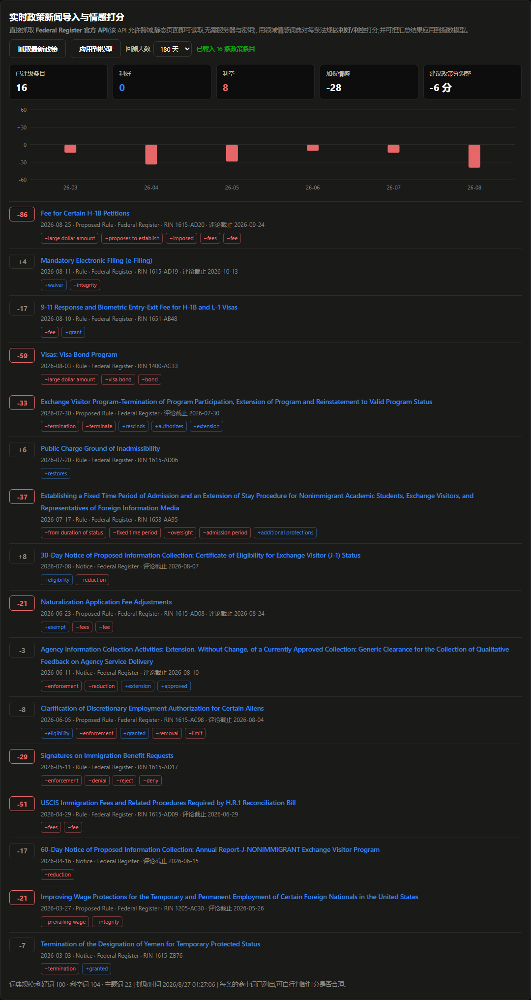
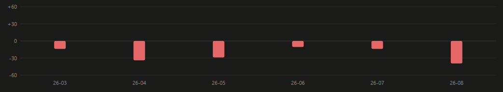
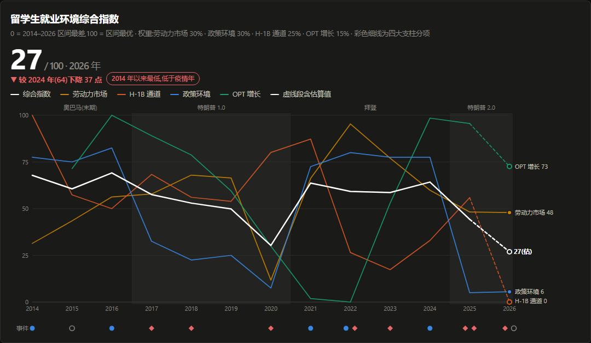
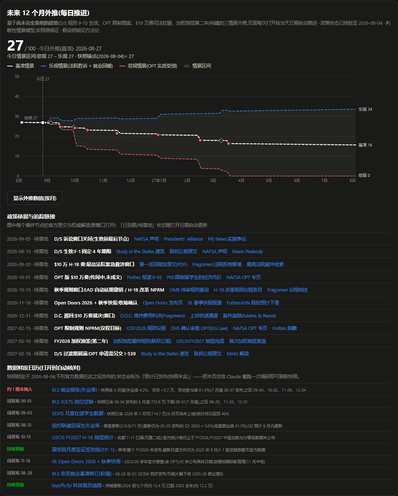
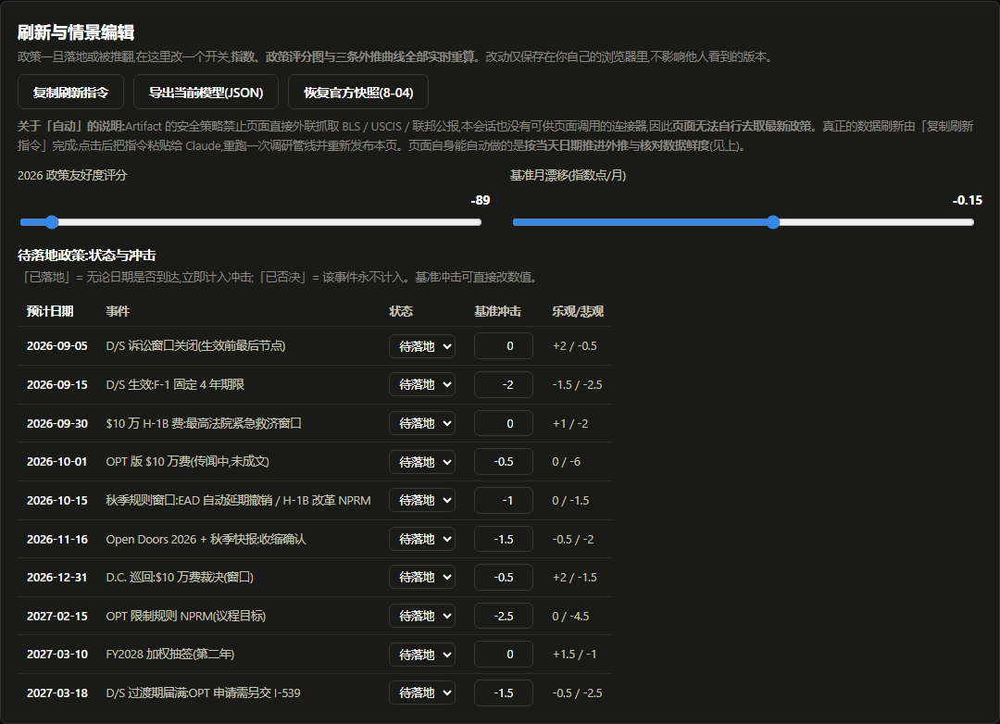
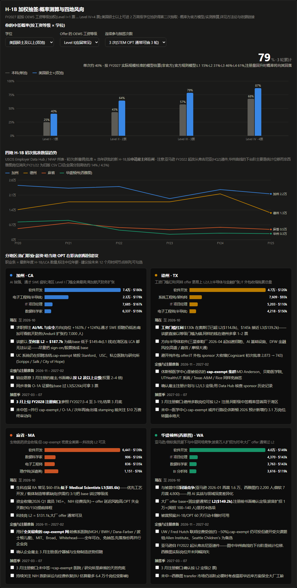
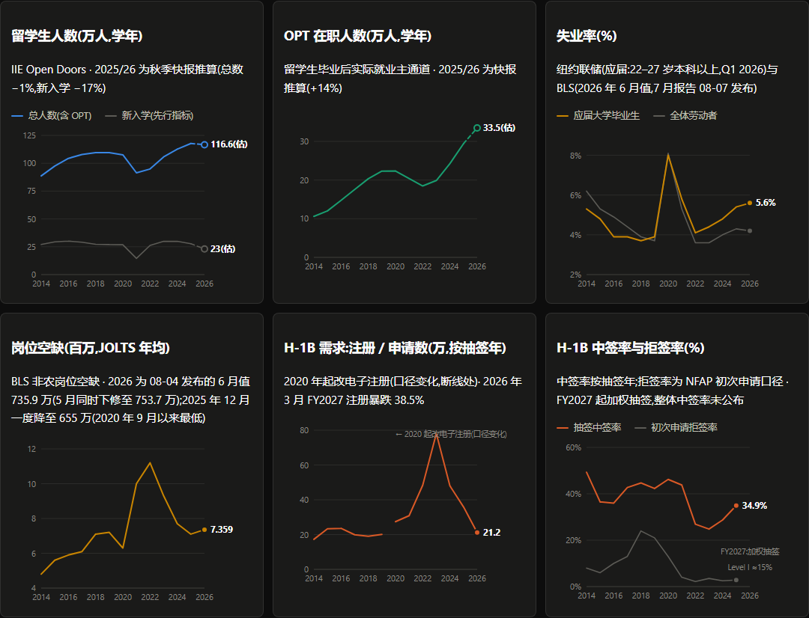
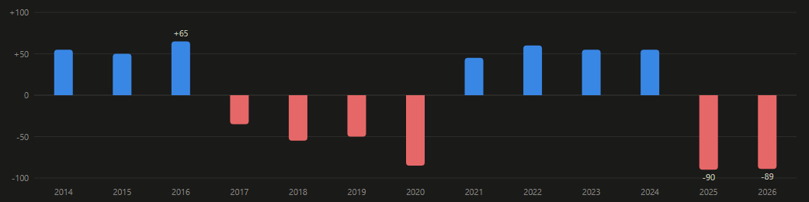

# 🎓 H1BJOBIndex — 美国留学生就业环境指数

<p align="center">
  <strong>把签证政策变成一条能看懂的曲线。</strong>
</p>

<p align="center">
  
  
  
  <a href="LICENSE"></a>
</p>

**H1BJOBIndex** 把留学生规模、OPT 实际就业、H-1B 通道、美国劳动力市场与移民政策这五个维度,合成为一个 0–100 的**留学生就业环境综合指数**(2014–2026),并在此之上做未来 12 个月的三情景外推。

它最有用的地方不是那条曲线,而是**曲线会自己更新**:页面直接抓取 Federal Register 官方 API,用一套领域情感词典给每一条新法规打出利好/利空分数,再把汇总结果接回指数模型。

整个项目是**一个静态页面**。没有构建步骤,没有依赖,没有后端,没有 API 密钥。

[实时新闻导入](#-实时新闻导入与情感打分) · [指数与外推](#-指数与三情景外推) · [H-1B 抽签测算](#-h-1b-加权抽签测算) · [快速开始](#-快速开始) · [方法论](#-方法论) · [数据来源](#-数据来源)

---

## 📰 实时新闻导入与情感打分

这是本项目的核心功能。点一下「抓取最新政策」,页面会:

1. 向 **Federal Register API** 发起 5 组检索(H-1B、OPT、SEVIS、specialty occupation、nonimmigrant student),合并去重;
2. 用 `lexicon.js` 里的领域词典给每条法规打分,范围 **−100(强利空)到 +100(强利好)**;
3. 按月汇总情感,给出建议的政策评分调整量;
4. 点「应用到模型」,指数、政策评分图与三条外推曲线**全部重算**。



**每条都把命中词摊开给你看** —— `−large dollar amount`、`−fixed time period`、`+waiver`。打分不是黑箱,你可以自己判断它是否合理。

按月汇总的情感走势(纵轴自适应):



### 为什么静态页面能抓到数据

Federal Register API 返回 `access-control-allow-origin: *`,所以浏览器可以直接跨域读取。这是整个设计的支点:**不需要服务器,也就不需要部署、密钥和运维**。

其他源(USCIS Newsroom RSS、Google News)不带 CORS 头,代码里保留了接口但默认关闭,需要自行配置代理。

### 情感词典怎么工作

`assets/js/lexicon.js` 是一套手写的、针对移民政策文本的词典,不是通用情感分析:

| 机制 | 作用 |
|---|---|
| **利好词 100 个 / 利空词 104 个** | 按 1–3 级加权。`vacated` `enjoined` `expanded` 为利好;`revoke` `terminate` `fixed time period` 为利空 |
| **主题词 22 个** | 相关性过滤。与留学生无关的移民新闻会被衰减到接近 0 分,不污染指数 |
| **最长匹配优先 + 跨度遮蔽** | `advanced degree exemption` 是在描述适用范围,不该因为里面有 `exemption` 就记成利好 |
| **整词否定检测** | `nonimmigrant` 里含有 `no`,子串匹配会误翻极性,所以否定词按整词比较 |
| **金额规则** | `$103,265` 这类大额收费是决定性利空;但若同一段文本出现 `vacated` / `enjoined`,说明该收费正被司法推翻,惩罚衰减到 1/4 |

> **词典是按真实语料校准的。** 最初用自己编的例句调参,结果发现机构摘要的行文完全不同 —— 终止 D/S 的最终规则实际写作 `fixed time period` 而不是 `fixed period of admission`,而 `extension` 出现在 `extension of status petitions must pay the fee` 里其实是负担不是利好。这些都是拿 Federal Register 真实条目重新校准后修掉的。

---

## 📈 指数与三情景外推



四大支柱各自成色,权重分别是劳动力市场 30%、政策环境 30%、H-1B 通道 25%、OPT 增长 15%,全部按 2014–2026 区间做 min-max 归一化 —— 指数衡量的是**相对位置**,不是绝对水平。

外推部分按**当天日期自动推进**(每日粒度),把尚未落地的政策作为事件节点,给出基准/乐观/悲观三条路径:



配套的情景编辑器可以把任何一个事件切成「已落地 / 已否决」,或直接改冲击数值,模型立刻重算。改动只存在你自己的浏览器里:



---

## 🎲 H-1B 加权抽签测算

FY2027 起按 OEWS 工资等级加权(Level I=1 票 … Level IV=4 票),美国硕士以上还能进第二个池。计算器按**学位 × 工资等级 × 抽签次数**给出累计中签概率,并附四地(加州 / 德州 / 麻省 / 华盛顿州)的批准量趋势与职业薪资分布:



五个维度的原始数据面板:



---

## 🏛 政策友好度评分

每一年按当年实际发生的规则、公告、执法与司法结果打分,范围 −100 到 +100。2017–2020 与 2025–2026 两段负值区间形状不同:前者是执法收紧,后者是结构性规则改写。



> 截图均为深色模式。主题跟随系统 `prefers-color-scheme`,也可被查看端的显式切换覆盖,浅色配色同样是单独校准过的,不是简单反色。

---

## 🚀 快速开始

```bash
git clone https://github.com/weihaoc168/H1BJOBIndex.git
cd H1BJOBIndex
python -m http.server 8000
# 打开 http://localhost:8000
```

任何静态服务器都可以(`npx serve`、nginx、GitHub Pages)。

直接双击 `index.html` 从 `file://` 打开也能看到全部图表,但**新闻抓取会被浏览器的跨域策略拦下** —— 要用实时功能,请走 HTTP。

### 部署到 GitHub Pages

```bash
gh repo edit --enable-pages --pages-branch main
```

没有构建步骤,推上去就是线上版本。

---

## 🧱 结构

```
H1BJOBIndex/
├── index.html                 # 页面骨架
├── assets/
│   ├── css/app.css            # 全部样式,含深浅双主题 token
│   └── js/
│       ├── lexicon.js         # 情感词典与打分器(可独立使用)
│       ├── news.js            # Federal Register / RSS 抓取与缓存
│       ├── app-core.js        # 指数模型、SVG 图表、外推引擎
│       └── news-ui.js         # 新闻面板渲染,并把结果接回模型
└── docs/screenshots/
```

四个模块都是普通脚本、挂全局对象,没有打包器,因此 `file://` 直接打开也不会报模块错误。

`app-core.js` 暴露了一个小 API 供外部驱动:

```js
window.H1BIndex.policyScore(-95);        // 改政策评分
window.H1BIndex.addEvent({ /* ... */ }); // 加一个外推事件
window.H1BIndex.refresh();               // 重算指数与全部图表
```

词典也能单独拿去用:

```js
window.H1BLexicon.grade(
  'Fee for Certain H-1B Petitions',
  'DHS proposes to establish a $103,265 fee for all cap-subject petitions...'
);
// → { score: -86, label: '强利空', hits: [...], relevance: 9 }
```

---

## 📐 方法论

- **指数构成**:劳动力市场 30%(应届毕业生失业率反向 + JOLTS 岗位空缺)、政策环境 30%、H-1B 通道 25%(中签率 × (1 − 拒签率))、OPT 增长 15%。
- **口径对齐**:学年数据取截止年(2024/25 → 2025);H-1B 抽签取抽签发生年(FY2027 → 2026 年 3 月);拒签率按财年。
- **外推**:`指数(t) = 快照锚点 + 已生效事件冲击之和 + 月漂移 × 经过月数`,截尾于 [0, 100]。
- **数据快照**:2026-08-04。历史序列是静态的;实时更新的是政策新闻层。

页面内的「指数构成与方法论」一节列出了每个估算点、每处已知口径断裂,以及三处已核验修正的常见错误。

---

## 📚 数据来源

| 来源 | 用途 |
|---|---|
| [Federal Register API](https://www.federalregister.gov/developers/documentation/api/v1) | **实时**法规抓取(唯一实时源) |
| [IIE Open Doors](https://opendoorsdata.org/) | 留学生与 OPT 年度普查 |
| [USCIS H-1B 电子注册](https://www.uscis.gov/working-in-the-united-states/temporary-workers/h-1b-specialty-occupations/h-1b-electronic-registration-process) | 抽签注册与中签数据 |
| [NFAP](https://nfap.com/) | H-1B 初次申请拒签率序列 |
| [BLS](https://www.bls.gov/) | 失业率与 JOLTS 岗位空缺 |
| [纽约联储](https://www.newyorkfed.org/research/college-labor-market) | 应届大学毕业生劳动力市场 |
| [DHS SEVIS](https://studyinthestates.dhs.gov/sevis-data-mapping-tool) | 月度在读学生数 |
| [DOL OFLC](https://flag.dol.gov/) | LCA 职业薪资与 OEWS 等级工资 |

---

## ⚠️ 说明

指数是**本项目构建的研究性指标**,不是官方统计。政策评分本质上是定性综合,情感打分是启发式的词典方法而非语义理解 —— 它会漏判反讽、复杂条件句和政策的二阶效应,所以界面把每条的命中词都摊开了。

外推的三条情景是判断性量化,事件日期与冲击幅度都是估计。真实路径大概率在区间内摆动,但不作保证。

**本项目不构成法律或移民建议。** 涉及个人身份决策,请咨询执业移民律师。

## 📄 License

[MIT](LICENSE)
